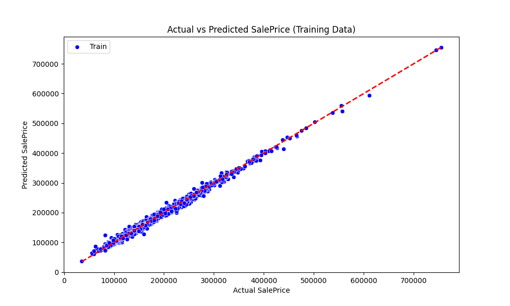
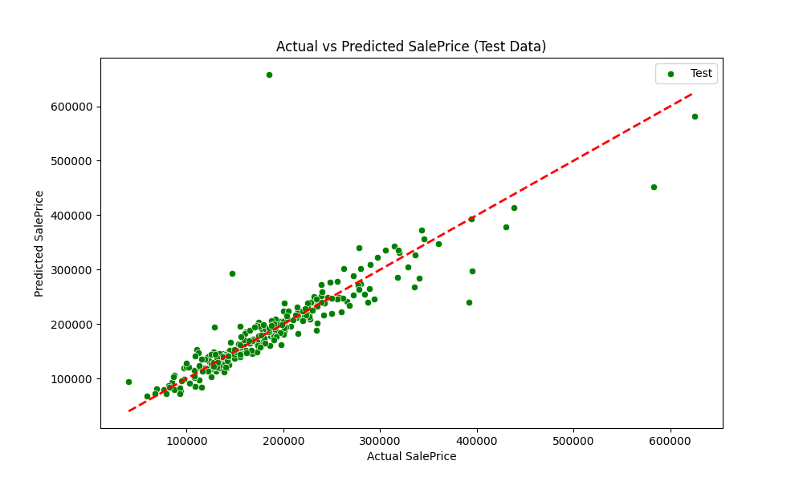

# House Price Prediction using XGBoost

This project demonstrates how to use the **XGBoost** algorithm to predict house prices based on various features. The model is trained and tested on a dataset, with results saved in a CSV file and visualized using scatter plots. Below is an overview of the main steps involved in this project.

## Project Overview

### 1. Data Preprocessing
- **Label Encoding**: All categorical variables in the dataset are converted into numerical form using label encoding.
- **Missing Values**: Any records with missing values in key features (e.g., `GarageYrBlt`) are filtered out to avoid issues during model training.
- **Feature Scaling**: The dataset is standardized using **StandardScaler**, ensuring all features are on the same scale, which helps improve the model's performance.

### 2. Model Training
- **Algorithm**: The **XGBoost** algorithm is used as the core machine learning model due to its efficiency and accuracy in regression tasks.
- **Hyperparameters**: Several hyperparameters are tuned, including the learning rate, maximum depth of trees, the minimum child weight, and the number of estimators.
- **Training**: The model is trained on 80% of the data, with the remaining 20% reserved for testing.

### 3. Model Evaluation
- **Evaluation Metric**: The model's performance is evaluated using **Root Mean Squared Error (RMSE)**, which measures how well the model predicts house prices compared to the actual prices.
- **RMSE Calculation**: RMSE values are calculated for both the training and test datasets, providing insight into the model's fit and generalization.

### 4. Test Predictions and Result Saving
- **Test Dataset**: Predictions are made on the unseen test dataset, which was not used in model training.
- **Output**: The predicted house prices are saved in a CSV file (`result_predictions.csv`) for further analysis.

### 5. Result Visualization
- **Training Data Visualization**: A scatter plot is generated to compare the actual vs predicted house prices on the training data. This helps in visually assessing how well the model fits the training data.

- **Test Data Visualization**: Similarly, a scatter plot is generated for the test data, showing how well the model generalizes to unseen data.

- **1:1 Line**: In both scatter plots, a red dashed line representing the ideal scenario (where predictions exactly match the actual prices) is plotted for reference.

## Result Files
- `train.csv`: The training dataset.
- `test.csv`: The test dataset used for final predictions.
- `result_predictions.csv`: A CSV file containing the predicted sale prices for the test dataset.

## Visualizations
- **Actual vs Predicted Sale Prices (Training Data)**: A scatter plot compares the actual sale prices to the model's predictions for the training dataset, helping visualize the model's accuracy.
- **Actual vs Predicted Sale Prices (Test Data)**: Another scatter plot compares the predicted sale prices for the test dataset, giving insight into the model's generalization ability.

## Conclusion
This project successfully demonstrates the use of **XGBoost** for predicting house prices, leveraging data preprocessing techniques, model evaluation, and result visualization. The generated predictions are saved for further analysis, and the scatter plots provide a clear picture of the model's performance on both the training and test datasets.
